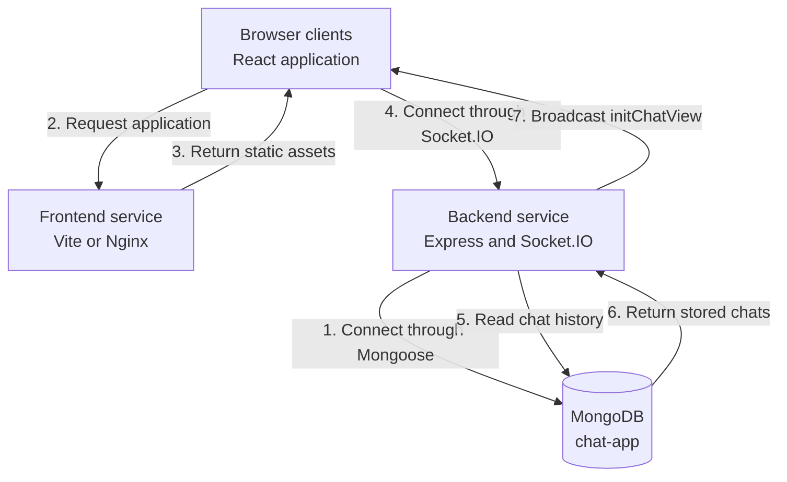
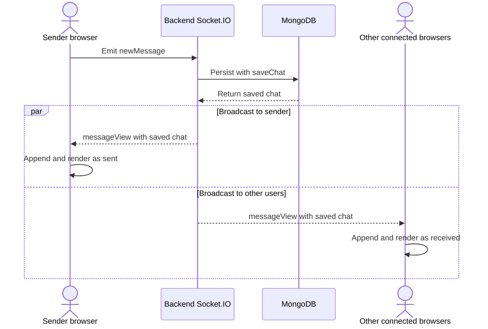

# Chat App

A small real-time chat application built with MongoDB, Express, React, Node.js, TypeScript, and Socket.IO.

## Features

- Join a chat with a username and generated avatar.
- Exchange messages with all connected clients in real time.
- Load persisted message history when connecting.
- Display sent and received messages with distinct layouts.

## Architecture

The repository contains two independent npm projects:

- `Frontend/` — a React and Vite client that manages the chat UI and Socket.IO connection.
- `Backend/` — an Express and Socket.IO server that persists messages through Mongoose.

The client emits `newMessage`. The server saves the message to MongoDB and broadcasts it as `messageView`; when a client connects, the server broadcasts the stored history as `initChatView`.

### Data flow

#### Application startup



#### Sending and receiving a message



## Getting started

### Docker

With Docker and Compose installed, start all three services:

```bash
docker compose up --build
```

Open `http://localhost:5173`. The backend is exposed at `http://localhost:3002`; MongoDB remains private to the Compose network and stores chat data in the `mongodb_data` volume.

Stop the services with `docker compose down`.

### Local development

Local development requires Node.js and npm plus MongoDB on `localhost:27017`. Docker and CI use Node.js 22.

1. Install both packages from the repository root:

   ```bash
   npm --prefix Backend ci
   npm --prefix Frontend ci
   ```

2. Start the backend:

   ```bash
   npm --prefix Backend run dev
   ```

3. In another terminal, start the frontend:

   ```bash
   npm --prefix Frontend run dev
   ```

4. Open the URL printed by Vite and enter a username. Use multiple browser windows to verify real-time delivery.

## Configuration

| Variable | Applied at | Default | Purpose |
|---|---|---|---|
| `MONGO_URI` | Backend runtime | `mongodb://localhost:27017/chat-app` | MongoDB connection |
| `PORT` | Backend runtime | `3002` | HTTP and Socket.IO port |
| `VITE_SERVER_URL` | Frontend build | `http://localhost:3002/` | Browser-facing backend URL |

Compose overrides `MONGO_URI` with the `mongodb` service name. When changing origins or ports, update `VITE_SERVER_URL` and `Backend/src/settings/CorsOptions.ts` together.

## Development

Run each command from its package directory.

| Package | Command | Purpose |
|---|---|---|
| Frontend | `npm run dev` | Start the Vite development server |
| Frontend | `npm run lint` | Run ESLint |
| Frontend | `npm run build` | Type-check and create a production build |
| Frontend | `npm run preview` | Preview the production build locally |
| Backend | `npm run dev` | Start the server with automatic restarts |
| Backend | `npm run build` | Compile TypeScript into `Backend/dist/` |
| Backend | `npm start` | Run the compiled server |

There is no automated test command. For messaging changes, manually verify history loading, sending, receiving, reconnecting, and persistence.

## Continuous integration

`.github/workflows/ci.yml` runs on pull requests and pushes to `main`. It installs locked dependencies with caching, lints the frontend, builds both packages, validates Compose, and builds both application images. Unit tests and coverage are omitted because neither package defines a test script.

## Troubleshooting

- If the backend logs a database connection error, confirm MongoDB is running on `localhost:27017`.
- If messages do not load or send, confirm the backend is listening on port `3002` and the frontend server URL matches it.
- If `npm start` fails in `Backend/`, run `npm run build` first to generate `dist/`.
